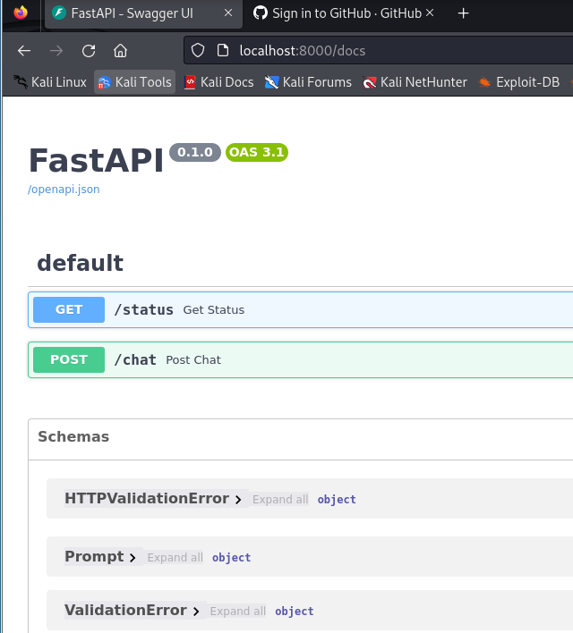

# EXAM vendredi 20/09

*Etape pour l'exam*

## Partie 1
-  Création de l'environnement virtuel :
    - python -m venv venv
    - source venv/bin/activate

 - Installation des dépendances :
    - Créer un fichier requirements.txt avec les packages nécessaires (groq, httpx, fastapi, pydantic).
    - pip install -r requirements.txt
    
- Ajout du code dans mini_groq.py :
    - Implémenter l'application FastAPI avec la gestion de la clé API via os.environ.

- Définition de la variable d'environnement :
    - export GROQ_API_KEY="clé_api"
 
 - Démarrage du srv:
     - uvicorn mini_groq:app --reload

- Test des routes :
    - http://localhost:8000/status et http://localhost:8000/chat

## Partie 2
-  Créer un fichier Docker pour l'application FastAPI
  
-  Build et lancer le container localement
    -  docker build -t fastapi-app .
    -  docker run -d -p 8000:8000 fastapi-app
      
-  Tester le container avec un curl
    -  curl -X POST http://localhost:8000/chat -H "Content-Type: application/json" -d '{"prompt":"What is a LLM?"}'
 
   

